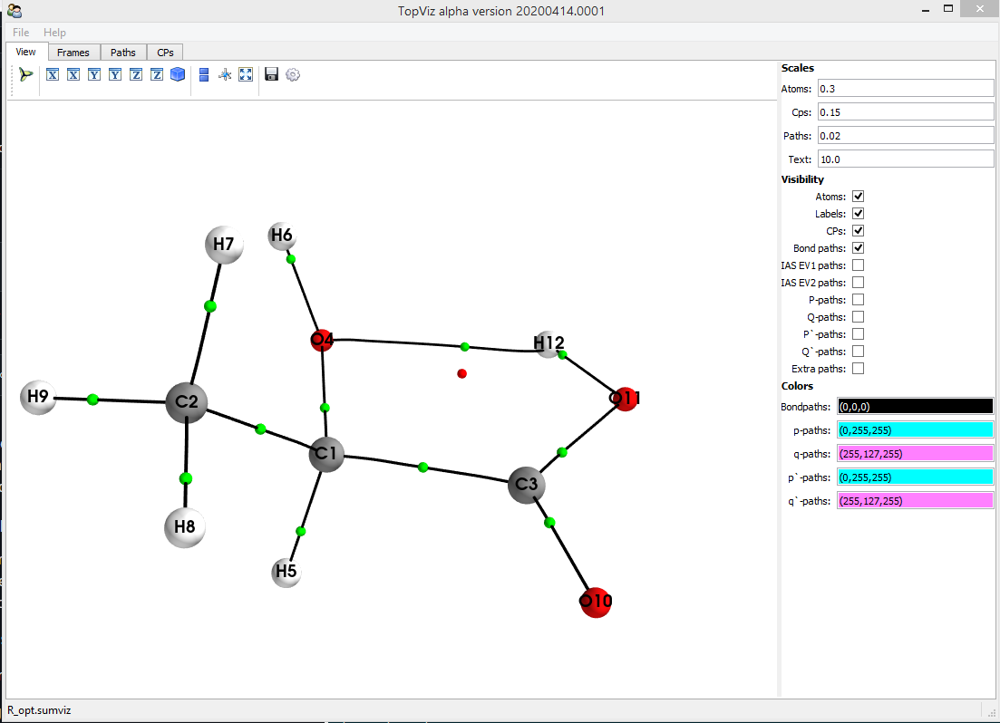

Interactive visualization GUI for molecular graphs and optional IAS paths (AIMAll .sumviz format) with optional associated paths in .path format from 'framepath' or the 'extreme' program from the AIMPAC2 Fortran package. This code can save rendered screenshots and 3-D models in X3D format.

Depends on: Traits, TraitsUI, mayavi2, PyQT5, VTK.

Some environment variables may need to be set to get Mayavi to display the structures (see Mayavi documentation and examples). There appears to be some issues with Mayavi and the exact version of VTK used, but if the Mayavi examples work for you then this should, too.

To see the full set of command line parameters: topviz --help

For a simple display of a .sumviz molecular graph : topviz --input mysumvizfile.sumviz

Eigenvector path data may be included using the --bondvectors option.

Currently an example of a .sumviz file and .path files can be found in the 'example' subdirectory.

TODO:

* Sortable table of critical point properties in 'CPs' tab  - (working in dev version)
* Sequences of molecular graphs with 'video-style' play/pause animation control (in progress)
* Overlaid vector fields (e.g. current density) and scalar fields (e.g. isosurfaced or volume-rendered density)
* Full load/save functionality for GUI menus (in progress)
* Embedding of provenance metadata (e.g. original full path of .sumviz or wavefunction file) in exported bitmaps (e.g. EXIF/IPTC in JPEG bitmaps,
  iTXT chunk in PNG bitmaps, generally avoiding the use of 'sidecar' files, an XML section in SVG files that graphics editors like InkScape don't
  just ignore ...)
  
